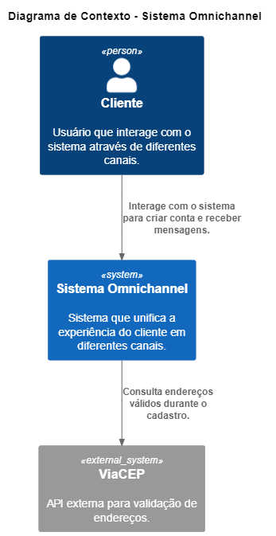
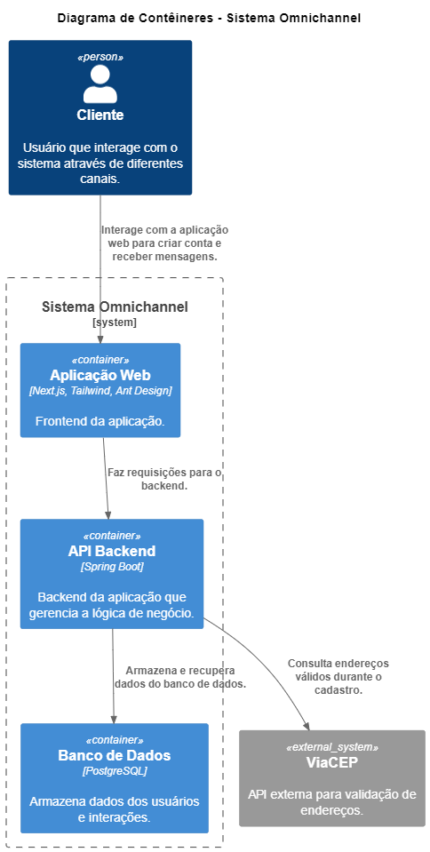
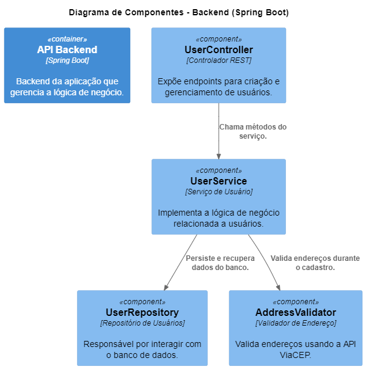

# Frontend - User Registration

Este projeto é o frontend para a aplicação de cadastro de usuários. Ele permite que os usuários criem suas contas através de um formulário.

## Tecnologias Utilizadas

* **Next.js:** Framework React para construção de aplicações web.
* **TypeScript:** Superset de JavaScript que adiciona tipagem estática.
* **Tailwind CSS:** Framework CSS para estilização utilitária.
* **Ant Design:** Biblioteca de componentes de UI para React.

## Pré-requisitos

* Node.js
* npm ou yarn

## Configuração

1.  **Clone o repositório:**

    ```bash
    git clone https://github.com/wenderenzo/user_register.git
    ```

2.  **Instalar as dependências:**

    ```bash
    npm install # ou yarn install
    ```

3.  **Configurar a URL da API:**

    * No arquivo `src/components/UserForm.tsx`, ajuste a URL da API para o seu backend:

        ```javascript
        const response = await fetch('http://localhost:8080/users', { // Ajuste a URL do seu backend
          method: 'POST',
          headers: {
            'Content-Type': 'application/json',
          },
          body: JSON.stringify(values),
        });
        ```

        Certifique-se de que a URL (`http://localhost:8080/users` neste exemplo) corresponda ao endereço onde sua API backend está rodando.

4.  **Executar a aplicação:**

    ```bash
    npm run dev # ou yarn dev
    ```

    * A aplicação estará disponível em `http://localhost:3000`.

## Estrutura do Projeto

* `components/`: Contém os componentes reutilizáveis, como o formulário de usuário (`UserForm.tsx`).
* `pages/`: Contém as páginas da aplicação (ex: `index.tsx` para a página inicial).
* `styles/`: Contém os estilos globais (ex: `globals.css`).
* `public/`: Contém os arquivos estáticos (ex: imagens).
* `src/types/`: Contém as definições de tipo do Typescript.

## Componentes Principais

* `UserForm`:  Componente que exibe o formulário de criação de usuário. Ele utiliza os componentes do Ant Design para a interface e faz a chamada para a API do backend para criar o usuário.

## Próximos Passos

* Implementar a listagem de usuários no frontend.
* Adicionar rotas para outras funcionalidades (se necessário).
* Melhorar o tratamento de erros e as mensagens para o usuário.
* Adicionar testes unitários e de integração.
* Configurar o deploy em um ambiente de produção.

# Arquitetura do Sistema

## Diagrama de Contexto



## Diagrama de Contêineres



## Diagrama de Componentes

